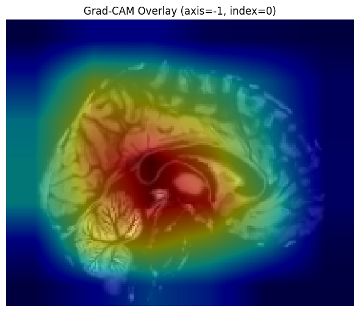
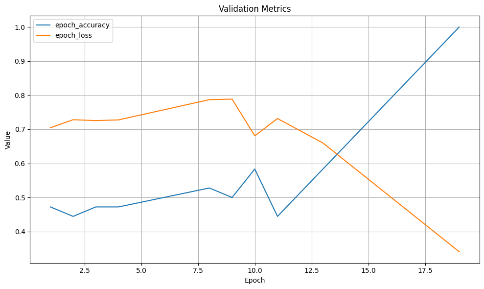

# Brain MRI Classification - 3D ResNet Baseline



## Overview

This repository contains a baseline implementation for brain MRI classification using a 3D ResNet architecture. The model is trained to distinguish between control subjects and patients based on structural MRI scans. The implementation includes:

- Data preprocessing pipeline with template registration
- 3D ResNet model with squeeze-and-excitation blocks
- Training and evaluation workflow
- Visualization tools for model interpretation
- Project guidelines for collaborators

## Project Structure

```text
.
├── src/
│   └── baseline/
│       ├── classification-3d-baseline.ipynb  # main baseline notebook
│       └── requirements.txt                  # dependencies for baseline
├── assets/                                   # various assets (e.g. images)
├── pyproject.toml                            # Ruff configuration
└── README.md
```

## Dataset Structure

The baseline expects the following dataset structure (anonymized medical data):

```text
/kaggle/input/brainsearch-classification/
├── CONTROLS/
│   ├── 1c00266a-1d74-4338-9e7a-c5cb1e9057ee.nii
│   └── ... (17 files total)
├── PATIENTS/
│   ├── 129d7b72-452d-417a-9d9b-a151d5f88295.nii
│   └── ... (17 files total)
└── data.md5
```

## Key Features

1. **Data Preprocessing**:
    - Automatic MNI152 template registration
    - Spatial normalization to RAS coordinate system
    - Intensity normalization (z-scoring)
    - Surface coordinate extraction for visualization
2. **3D ResNet Model**:
    - Residual skip connections
    - Multi-scale feature extraction
    - Classification head with softmax activation
3. **Visualization Tools**:
    - Interactive 3D brain surface visualization
    - Multi-planar reconstruction views
    - Grad-CAM for model interpretability
    - 3D activation heatmaps

## Getting Started

### Prerequisites

- Python 3.11
- NVIDIA GPU with ≥12GB VRAM (P100 or higher recommended)
- Kaggle environment (2025-05-13 recommended) or compatible local setup

### Installation

1. Clone the repository:
```bash
git clone https://gitverse.ru/brainsearch/brain-classification-3d.git
cd brain-classification-3d
```
2. Install dependencies:
```bash
pip install tensorflow==2.18.0 nibabel==5.3.2 plotly==5.24.1 scipy==1.15.2 scikit-learn statsmodels
```

### Running the Baseline

1. Place your dataset in the expected structure
2. Open `src/baseline/classification-3d-baseline.ipynb`
3. Execute cells sequentially

## Collaboration Guidelines

### Branching Strategy

1. Create a personal branch named after your username:
```bash
git checkout -b <username>
```
2. Work in your personal directory under `src/`:
```text
src/
└── <username>/
    ├── classification-3d-<username>.ipynb
    ├── README.md          # your specific documentation
    └── requirements.txt   # your specific dependencies
```

### Notebook Naming Convention

- Name your notebooks: `classification-3d-<username>.ipynb`
- Example: `classification-3d-john-doe.ipynb`

### Best Practices

1. **Reproducibility**:
    - Include a `requirements.txt` with all dependencies (or describe in the notebook)
    - Document custom data preprocessing steps
    - Seed random number generators (optional)
2. **Performance**:
    - Optimize for GPU memory constraints
    - Use mixed-precision training where possible
    - Implement data augmentation
3. **Documentation**:
    - Add docstrings to custom functions
    - Explain model architecture choices
    - Include visualizations of key results

### Pull Requests

1. Keep PRs focused on specific improvements
2. Include visual comparisons where applicable
3. Document performance metrics:
    - Accuracy
    - Training time

## Baseline Performance

|Metric|Value|
|---|---|
|Accuracy|99.9%|
|Training Time|12 min|
|Parameters|12.4M|


*Results on Kaggle P100 GPU with 18+18 samples*

## Future Work

- Implement metric learning approach
- Implement data augmentation techniques
- Experiment with different backbone architectures
- Experiment with zero-shot and few-shot approaches
- Incorporate transfer learning from larger datasets
- Add cross-validation workflow
- Develop ensemble methods

## License

This project is licensed under the MIT License - see the [LICENSE](LICENSE) file for details.

## Acknowledgments

- ANTsPyNet for 3D ResNet implementation
- MNI152 template providers
- Kaggle for computational resources